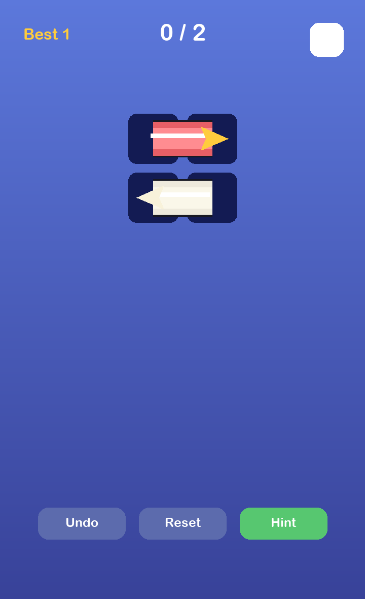
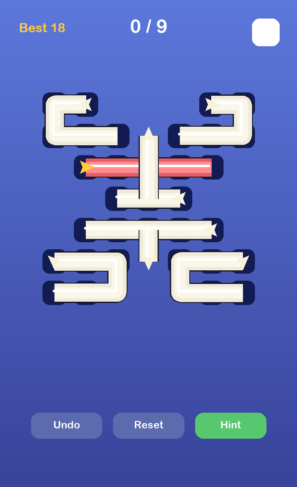
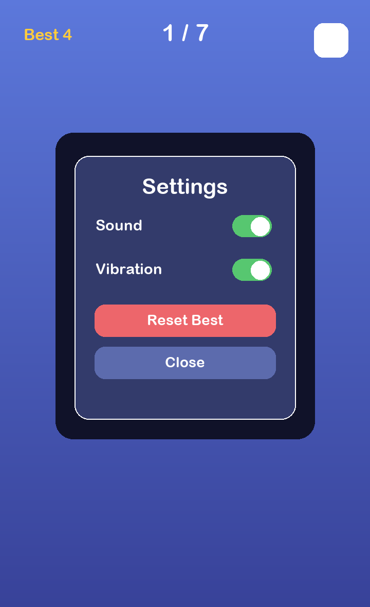

# Arrow Escape

Arrow Escape is a calm, touch-first directional puzzle for the Playground hub. Choose a long bent arrow piece whose whole path can slide out through its arrowhead direction, and the complete piece gently slips away. Keep going until the board is empty.

Levels are deterministic from their level number and seed. They are generated from a valid removal order and checked before play, so every board is solvable. A tiny straight-piece onboarding board introduces the rules before later boards use 2–4 segment bent orthogonal pieces packed into arrows, diamonds, hexagons, zigzags, and friendly fish, cat, and butterfly silhouettes. The pieces are intentionally mostly monochrome; the red treatment marks a selected hint/highlighted piece.

## Screenshots

| Straight-piece onboarding board | Butterfly board with bent arrow pieces | Settings and accessibility controls |
| --- | --- | --- |
|  |  |  |

## Local preview

```bash
python3 -m http.server 4173
```

Open <http://localhost:4173/>. The game is a self-contained static PWA with relative paths and a cache-first service worker.

## Validation

```bash
node --test tests/test-game.js
node --check js/game.js && node --check js/main.js && node --check js/i18n.js && node --check js/audio.js
python3 -m json.tool manifest.webmanifest >/dev/null
python3 scripts/generate_readme_screenshots.py
```

Use Settings for sound, vibration, reset, and the hub return button. English and Hebrew UI are supported; the directional pieces remain geometrically literal in RTL.
